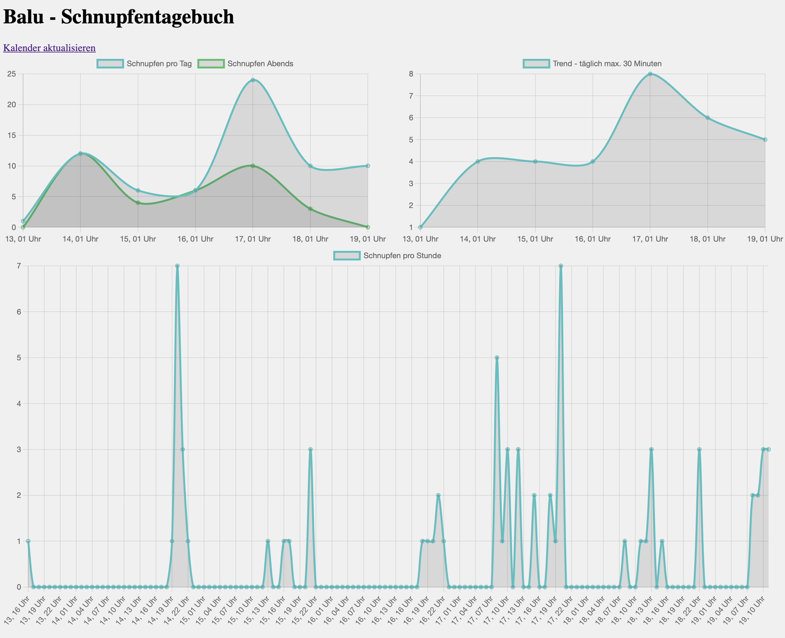

# Symptom-Diary

The goal of this code base is to be able to display tracked symptom data of a pet for example and display it visually by using chart.js. None of this code is written either clean or readable. The main goal is to get something visible with the minimum amount of effort.



## Getting started

Add a `config.json` with the following content

```json
{
    "calendarUrl": "myfile.ics"
}
```